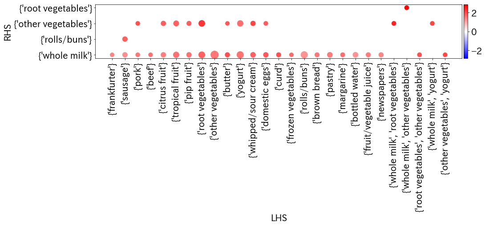
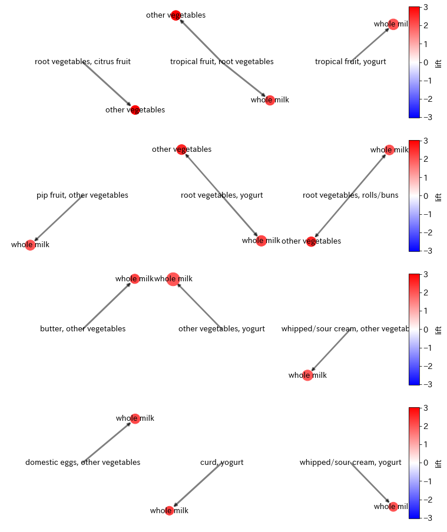

# association-rules-viz
Visualization library for association analysis

## Usage

```python
matrix('antecedents', 'consequents', size='support', color='lift',
       data=data, cmap='bwr', font_size=20)
```



- Larger circles imply higher support
- Red circles imply higher lift

```python
graph('antecedents', 'consequents', support='support', confidence='confidence',
      lift='lift', data=data, fig_scale=4, font_size=13, cmap='bwr')
```



- Larger circles imply higher support
- Wider arrows imply higher confidence
- Red circles imply higher lift
